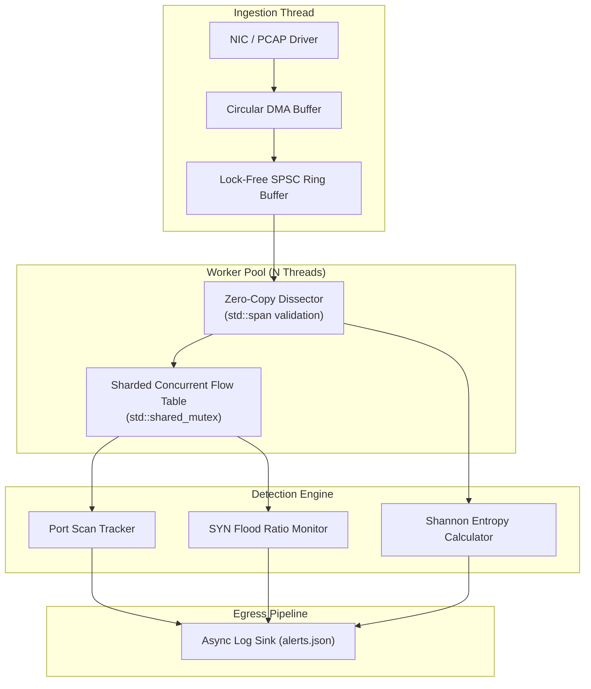

# Architecture & System Design Specification

This document details the internal design, concurrency models, and algorithmic primitives powering `nids-engine`.

---

## 1. Pipeline Overview

The engine separates network ingestion from detection analysis to prevent packet loss under bursty network loads:



---

## 2. Zero-Copy Protocol Dissection

High-speed packet capture cannot tolerate heap allocations per frame. Standard C++ string or vector instantiation on a 1 Gbps link (up to 1.48 million packets/sec) results in severe memory allocator thrashing.

### Memory Boundary Validation
Every dissecting step utilizes `std::span<const uint8_t>` to model sub-ranges without memory copies:

1. **Ethernet Layer (`14 bytes`):**
   ```cpp
   struct EthernetHeader {
       std::array<uint8_t, 6> dst_mac;
       std::array<uint8_t, 6> src_mac;
       uint16_t ethertype;
   };
   ```
   Validates buffer length $\ge 14$ bytes. Extracts `ethertype` in host endianness via `ntohs`.
2. **IPv4 Layer (`20+ bytes`):**
   Validates version field equals `4`, verifies Internet Header Length (`ihl >= 5`), and validates total length against available span size.
3. **TCP Layer (`20+ bytes`):**
   Decodes `data_offset` (`doff * 4` bytes), checks flags (`SYN`, `ACK`, `FIN`, `RST`, `PSH`, `URG`), and isolates the trailing application payload buffer.

---

## 3. Stateful Flow Tracking

Packets are grouped into bidirectional sessions using a 5-tuple hash key:
$$\text{Key} = (\text{SrcIP}, \text{DstIP}, \text{SrcPort}, \text{DstPort}, \text{Protocol})$$

### Canonical Flow Normalization
To ensure both client-to-server and server-to-client packets map to the identical session entry, the 5-tuple is canonically sorted:
- If $(\text{SrcIP} > \text{DstIP}) \lor (\text{SrcIP} == \text{DstIP} \land \text{SrcPort} > \text{DstPort})$, swap source and destination pairs during lookup while tagging direction flag.

### Sharded Concurrency Architecture
A single global mutex over the entire flow map creates massive cache-line contention among worker threads. `nids-engine` implements a **16-shard table**:
- Hash of the 5-tuple determines the shard index (`hash % 16`).
- Each shard contains its own independent `std::unordered_map` guarded by a dedicated `std::shared_mutex`.
- Reads (packet counter increments) acquire shared lock (`std::shared_lock`); new session allocations acquire exclusive lock (`std::unique_lock`).

---

## 4. Algorithmic Threat Detection

### 4.1 Shannon Entropy Analysis
Encrypted command-and-control (C2) payloads, packed shellcode, and exfiltration tunnels exhibit high byte randomness compared to ASCII-based protocols (HTTP, SMTP).

Entropy is computed over the payload byte distribution:
$$H(X) = -\sum_{i=0}^{255} P(x_i) \log_2 P(x_i)$$

Where:
- $P(x_i) = \frac{\text{count}(x_i)}{N}$
- $N$ is total payload length ($N \ge 32$ bytes minimum threshold to prevent false positives on short control frames).

**Scoring Thresholds:**
- Plaintext ASCII (HTTP GET / JSON): $H \approx 3.2 - 4.5$
- Compressed Images (JPEG/PNG): $H \approx 7.0 - 7.4$
- High-Entropy Exfiltration / Encrypted Payload: $H \ge 7.6$ (Triggers anomaly alert)

### 4.2 Sliding-Window Port Scan Detection
Attacker reconnaissance (e.g. `nmap -sS -p 1-1000`) sends connection requests across a wide range of ports over a short time window.

- **State:** Each active source IP maintains a time-bucketed ring of contacted destination ports:
  ```cpp
  struct ScanBucket {
      std::chrono::steady_clock::time_point timestamp;
      uint16_t dst_port;
  };
  ```
- **Rule:** If $\text{count}(\text{distinct dst\_ports}) \ge 20$ within $T = 5.0\text{ seconds}$, a `THREAT_PORT_SCAN` alert is emitted with the complete list of targeted services.

### 4.3 SYN Flood / Asymmetric Half-Open Ratio
Denial-of-Service attacks saturate server backlog queues by transmitting initial `SYN` packets without completing the 3-way handshake.

- **Metric:**
  $$R_{\text{syn}} = \frac{\text{SYN Count}}{\text{ACK Count} + 1}$$
- **Rule:** When total `SYN` packets from a host exceed 200 and $R_{\text{syn}} > 0.85$, the source host is flagged under `THREAT_SYN_FLOOD`.

---

## 5. Memory Management & RAII Principles

All low-level operating system resources (PCAP capture handles, sockets, mapped file descriptors) are wrapped in RAII lifecycle handlers with custom deleters:

```cpp
struct PcapDeleter {
    void operator()(pcap_t* handle) const noexcept {
        if (handle) pcap_close(handle);
    }
};
using UniquePcapHandle = std::unique_ptr<pcap_t, PcapDeleter>;
```

This guarantees zero resource leaks during abnormal termination, unhandled exceptions, or `SIGINT` (Ctrl+C) graceful shutdown sequences.
