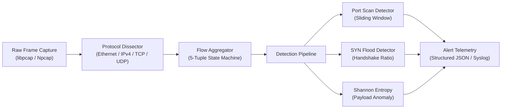

<p align="center">
  
</p>

<h1 align="center">nids-engine</h1>

<p align="center">
  <strong>High-throughput, cross-platform Network Intrusion Detection System and protocol dissector written in Modern C++20 for real-time anomaly classification and threat telemetry.</strong>
</p>

<p align="center">
  <a href="https://github.com/dusmamud/nids-engine/actions/workflows/ci.yml"></a>
  <a href="LICENSE"></a>
  <a href="https://en.cppreference.com/w/cpp/20"></a>
</p>

## Overview

`nids-engine` processes raw network frames directly from Network Interface Cards (NIC) in promiscuous mode or offline PCAP traces. It dissects packet headers via zero-copy memory views (`std::span`), aggregates stateful bidirectional 5-tuple conversations, and executes multi-threaded detection heuristics to catch scanning behavior, half-open DoS floods, and high-entropy exfiltration channels.

Designed for high-throughput environments, the engine minimizes allocations on the packet path, utilizing intrusive ring buffers, thread-safe sharded flow tables, and vectorized payload inspection.

---

## Architecture & System Design



For comprehensive details on memory layout, lock-free queues, and detection algorithms, consult [ARCHITECTURE.md](ARCHITECTURE.md).

---

## Core Detection Capabilities

| Threat Vector | Detection Mechanism | Algorithmic Complexity | Reference |
| :--- | :--- | :--- | :--- |
| **Port Scanning** | Sliding-window unique destination port counter per source IP | `O(1)` amortized hash lookup | [RFC 793 (TCP)](https://datatracker.ietf.org/doc/html/rfc793) |
| **SYN Flood DoS** | Half-open connection ratio tracking with threshold triggering | `O(1)` per SYN/ACK packet | [CERT Advisory CA-1996-21](https://www.cisa.gov/) |
| **Payload Exfiltration** | Shannon entropy calculation over Layer 7 payload buffers ($H \ge 7.6$) | `O(N)` where $N \le 1500$ bytes | [Information Theory (Shannon)](https://en.wikipedia.org/wiki/Entropy_(information_theory)) |
| **ARP Spoofing** | Gateway MAC mismatch and gratuitous ARP anomaly verification | `O(1)` state comparison | [RFC 826 (ARP)](https://datatracker.ietf.org/doc/html/rfc826) |

---

## Prerequisites

- **Compiler:** Clang 15+, GCC 12+, or MSVC 2022 (supporting full C++20 features: `std::span`, `std::jthread`, concepts).
- **Build System:** [CMake 3.20+](https://cmake.org/cmake/help/latest/) and Ninja or Make.
- **Packet Capture Libraries:**
  - **Linux:** [libpcap](https://www.tcpdump.org/pcap.html) (`sudo apt-get install libpcap-dev`)
  - **Windows:** [Npcap SDK](https://npcap.com/#download) (installed in standard include paths)

---

## Quickstart

### 1. Clone & Setup

```bash
git clone https://github.com/dusmamud/nids-engine.git
cd nids-engine
```

### 2. Configure and Compile

```bash
# Configure build with tests enabled
cmake -B build -S . -DCMAKE_BUILD_TYPE=Release -DBUILD_TESTS=ON

# Compile binary
cmake --build build --config Release -j$(nproc 2>/dev/null || echo 4)
```

### 3. Run Live Capture or Replay PCAP

```bash
# Run against live interface (Requires Administrator / root privileges)
./build/bin/nids-engine --interface eth0 --alert-log alerts.json

# Analyze offline PCAP capture file
./build/bin/nids-engine --read-pcap samples/syn_flood.pcap --verbose
```

---

## Configuration & CLI Options

| Argument | Description | Default | Required |
| :--- | :--- | :--- | :--- |
| `-i`, `--interface` | Network interface name for live packet sniffing | Auto-detect default | No (unless offline) |
| `-r`, `--read-pcap` | Path to offline `.pcap` or `.pcapng` file | - | No |
| `-o`, `--alert-log` | Path for structured JSON alerts output | `alerts.json` | No |
| `-v`, `--verbose` | Enable real-time frame telemetry printing | `false` | No |
| `--scan-threshold` | Number of distinct ports hit before triggering port-scan alert | `20` ports / 5s | No |
| `--syn-ratio` | Unanswered SYN to ACK ratio before triggering DoS alert | `0.85` | No |

---
 
## Live Telemetry & Threat Detection Demo

Execution trace of `nids-engine` running multi-scenario simulated attacks (Nmap reconnaissance port scans, asymmetric SYN flood DoS, and high-entropy C2 data exfiltration):

<p align="center">
  
</p>

---

## Verification & Testing

The test suite validates protocol dissection against known packet byte streams and validates statistical accuracy for entropy scoring:

```bash
# Run all unit tests via CTest
ctest --test-dir build --output-on-failure

# Run directly
./build/bin/nids-tests
```

---

## Maintainer & Author

Authored and maintained by **Dus Mamud** ([@dusmamud](https://github.com/dusmamud)).

## License

Distributed under the [MIT License](LICENSE). Copyright (c) 2026 Dus Mamud.
