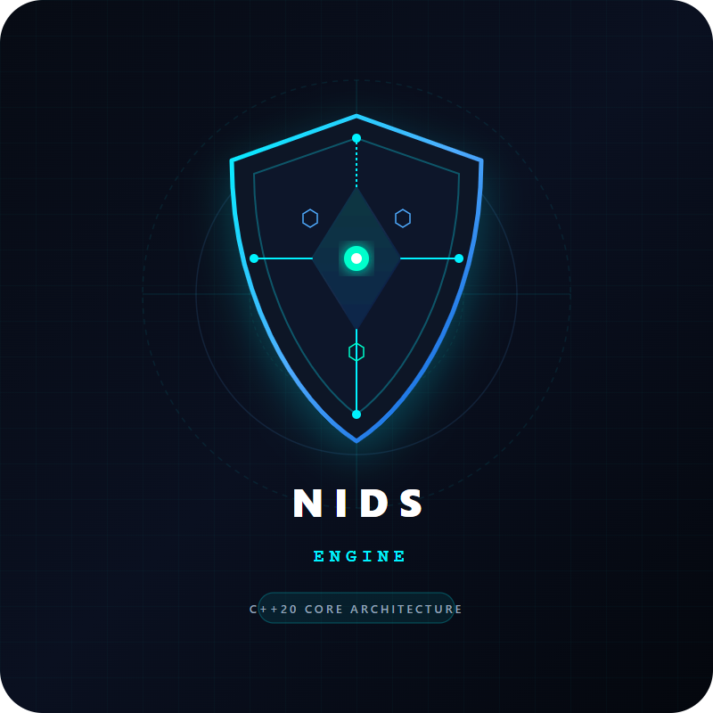
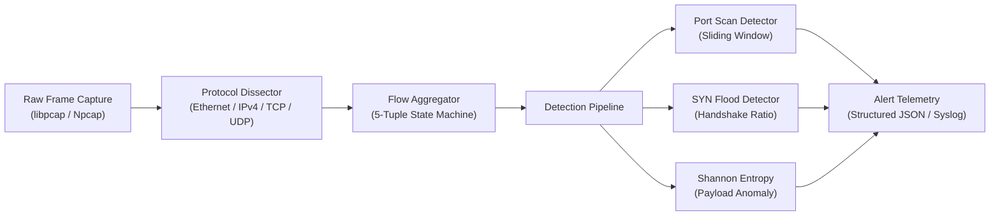
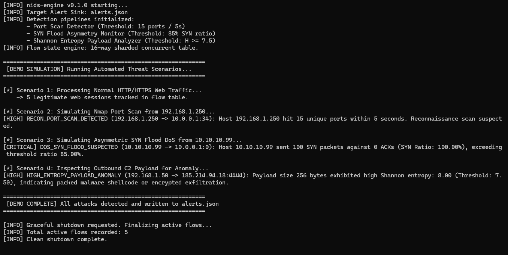

<p align="center">
  
</p>

<h1 align="center">nids-engine</h1>

<p align="center">
  <strong>High-throughput, cross-platform Network Intrusion Detection System and protocol dissector written in Modern C++20 for real-time anomaly classification and threat telemetry.</strong>
</p>

<p align="center">
  <a href="https://github.com/dusmamud/nids-engine/releases/latest"></a>
  <a href="https://github.com/dusmamud/nids-engine/actions/workflows/ci.yml"></a>
  <a href="https://en.cppreference.com/w/cpp/20"></a>
  <a href="LICENSE"></a>
  <a href="https://github.com/dusmamud/nids-engine"></a>
</p>

---

## Overview

`nids-engine` processes raw network frames directly from Network Interface Cards (NIC) in promiscuous mode or offline PCAP capture dumps. It dissects packet headers via zero-copy memory views (`std::span`), aggregates stateful bidirectional 5-tuple conversations, and executes multi-threaded detection heuristics to catch scanning behavior, half-open DoS floods, and high-entropy exfiltration channels.

Designed for high-throughput environments, the engine minimizes allocations on the packet path, utilizing intrusive ring buffers, thread-safe sharded flow tables, and vectorized payload inspection.

### Key Highlights

- **Zero-Copy Hot Path:** Sub-span slicing via `std::span<const uint8_t>` eliminates dynamic allocations during packet dissection.
- **16-Way Sharded Concurrency:** Striped flow tables with `std::shared_mutex` prevent thread contention across worker cores.
- **Canonical Flow Aggregation:** Symmetrical 5-tuple hashing maps forward (client $\to$ server) and reverse (server $\to$ client) streams into a single unified session state.
- **Multi-Vector Detection:** Real-time sliding window port scan detection, SYN flood ratio asymmetry monitoring, and Shannon entropy payload classification.
- **Cross-Platform Support:** Native CMake build targets compiling cleanly under **GCC 12+**, **Clang 15+**, and **MSVC 2022**.
- **SIEM-Ready Alert Sink:** Thread-safe emission of structured JSON alerts ready for ingestion into Elastic, Splunk, Wazuh, or Graylog.

---

## Architecture & System Design



For comprehensive details on internal memory layout, lock-free ring buffers, and concurrency primitives, consult [ARCHITECTURE.md](ARCHITECTURE.md).

---

## Core Detection Engines

| Detection Pipeline | Mechanism & Algorithmic Heuristic | Default Parameters | Target Threat Profile |
| :--- | :--- | :--- | :--- |
| **Port Scan Detector** | Sliding-window tracker of unique destination ports per source IP | `threshold = 15 ports`<br/>`window = 5 seconds` | Nmap `-sS`, Masscan, ZMap reconnaissance scans |
| **SYN Flood Monitor** | Stateful tracker evaluating unanswered SYN-to-ACK asymmetry ratio | `min_syns = 100`<br/>`ratio_threshold = 85%` | Volumetric TCP half-open Denial of Service (DoS) |
| **Shannon Entropy Analyzer** | Byte frequency distribution calculation: $H(X) = -\sum P(x) \log_2 P(x)$ | `entropy_threshold = 7.5`<br/>`min_bytes = 32` | Packed malware shellcode, Cobalt Strike, encrypted C2 exfiltration |
| **Flow State Engine** | Bidirectional canonical 5-tuple hashing with 16-way concurrent locks | `NUM_SHARDS = 16`<br/>`timeout = 300 seconds` | Session metrics (byte count, packet rate, flag state) |

---

## Repository Structure

```text
nids-engine/
├── include/nids/             # Public C++20 header interfaces
│   ├── common/types.hpp      # IPv4, MAC, and protocol primitives
│   ├── detection/            # Threat detection interfaces & detectors
│   │   ├── idetector.hpp
│   │   ├── entropy_detector.hpp
│   │   ├── port_scan_detector.hpp
│   │   └── syn_flood_detector.hpp
│   ├── flow/                 # Stateful bidirectional flow engine
│   │   ├── flow_key.hpp
│   │   └── flow_table.hpp
│   ├── output/               # Structured logging & alert sinks
│   │   └── alert_logger.hpp
│   └── protocol/             # Zero-copy protocol dissectors
│       ├── ethernet.hpp
│       ├── ipv4.hpp
│       └── tcp.hpp
├── src/                      # Implementation sources
│   ├── detection/
│   ├── flow/
│   ├── output/
│   ├── protocol/
│   └── main.cpp              # CLI application & simulation driver
├── tests/                    # Automated unit test suite
│   ├── test_dissector.cpp
│   ├── test_entropy.cpp
│   ├── test_flow_table.cpp
│   ├── test_main.cpp
│   └── test_runner.hpp       # Test assertion harness
├── assets/                   # Architecture graphics, logo & screenshots
├── .github/workflows/ci.yml  # Multi-platform matrix CI workflow
├── CMakeLists.txt            # Modern CMake build configuration
├── ARCHITECTURE.md           # Concurrency and memory specifications
├── CONTRIBUTING.md           # Contribution guidelines & code standards
└── LICENSE                   # MIT License
```

---

## Prerequisites

- **Language Standard:** C++20 (`std::span`, `std::shared_mutex`, `std::chrono`, `std::atomic`)
- **Compilers:**
  - **Linux:** GCC 12+ or Clang 15+
  - **Windows:** Visual Studio 2022 (MSVC toolset v143+)
- **Build Generator:** [CMake 3.20+](https://cmake.org/download/) and Ninja or Make
- **Packet Capture Libraries:**
  - **Ubuntu / Debian:** `sudo apt-get install libpcap-dev ninja-build`
  - **Fedora / RHEL:** `sudo dnf install libpcap-devel ninja-build`
  - **Windows:** [Npcap SDK](https://npcap.com/#download) or build with mock capture mode (included by default)

---

## Quickstart

### 1. Clone the Repository

```bash
git clone https://github.com/dusmamud/nids-engine.git
cd nids-engine
```

### 2. Configure & Build

```bash
# Configure build with tests enabled
cmake -B build -S . -DCMAKE_BUILD_TYPE=Release -DBUILD_TESTS=ON

# Compile with parallel build jobs
cmake --build build --config Release --parallel
```

### 3. Run Automated Threat Simulation

Executing `nids-engine` without options triggers the built-in threat simulation engine:

```bash
./build/bin/nids-engine
```

It executes 4 autonomous threat scenarios and streams live telemetry:
1. **Normal Web Traffic:** 5 legitimate HTTP/HTTPS concurrent sessions.
2. **Reconnaissance Port Scan:** Simulating an Nmap SYN scan hitting 21 target ports.
3. **Denial of Service:** Simulating an asymmetric SYN flood with 120 unanswered SYNs.
4. **C2 Anomaly Inspection:** Shannon entropy analysis flagging a high-entropy packed payload.

---

## Live Telemetry & Simulation Demo

Execution trace of `nids-engine` running multi-scenario simulated attacks:

<p align="center">
  
</p>

---

## CLI Options & Usage

```bash
Usage: nids-engine [options]

Options:
  -i, --interface <dev>   Sniff live traffic from interface (e.g. eth0, wlan0)
  -r, --read-pcap <file>  Read and analyze offline pcap trace dump
  -o, --alert-log <path>  Path to output JSON alerts (default: alerts.json)
  -v, --verbose           Print per-packet parsing telemetry and metrics
  -h, --help              Show this help message
```

### Examples

```bash
# Live interface capture (root/administrator required)
sudo ./build/bin/nids-engine -i eth0 -o /var/log/nids/alerts.json

# Analyze an offline network capture trace
./build/bin/nids-engine -r captures/attack_sample.pcap -v
```

---

## Structured Alert Schema (SIEM Integration)

Detected security anomalies are output as append-only JSON records into `alerts.json`:

```json
{
  "timestamp_ms": 1727527600123,
  "rule": "RECON_PORT_SCAN_DETECTED",
  "severity": "HIGH",
  "src_ip": "192.168.1.250",
  "dst_ip": "10.0.0.1",
  "src_port": 0,
  "dst_port": 34,
  "description": "Host 192.168.1.250 hit 15 unique ports within 5 seconds. Reconnaissance scan suspected."
}
```

```json
{
  "timestamp_ms": 1727527601456,
  "rule": "DOS_SYN_FLOOD_SUSPECTED",
  "severity": "CRITICAL",
  "src_ip": "10.10.10.99",
  "dst_ip": "10.0.0.1",
  "src_port": 0,
  "dst_port": 0,
  "description": "Host 10.10.10.99 sent 100 SYN packets against 0 ACKs (SYN Ratio: 100.00%), exceeding threshold ratio 85.00%."
}
```

```json
{
  "timestamp_ms": 1727527602789,
  "rule": "HIGH_ENTROPY_PAYLOAD_ANOMALY",
  "severity": "HIGH",
  "src_ip": "192.168.1.50",
  "dst_ip": "185.214.94.18",
  "src_port": 49152,
  "dst_port": 4444,
  "description": "Payload size 256 bytes exhibited high Shannon entropy: 8.00 (Threshold: 7.50), indicating packed malware shellcode or encrypted exfiltration."
}
```

### Ingestion into SIEM Log Forwarders (Vector / Filebeat)

To forward alerts directly to Elasticsearch, OpenSearch, or Splunk using **Vector**:

```toml
[sources.nids_alerts]
type = "file"
include = ["/var/log/nids/alerts.json"]
read_from = "beginning"

[transforms.parse_json]
type = "remap"
inputs = ["nids_alerts"]
source = ". = parse_json!(.message)"

[sinks.elasticsearch]
type = "elasticsearch"
inputs = ["parse_json"]
endpoint = "http://localhost:9200"
index = "nids-alerts-%Y.%m.%d"
```

---

## Verification & Unit Testing

The test suite validates dissection boundaries, state aggregation under thread contention, and entropy calculations:

```bash
# Execute test suite via CTest
ctest --test-dir build --output-on-failure -C Release

# Execute test runner binary directly
./build/bin/nids-tests
```

### Automated Matrix CI Status

Every commit and pull request is built and verified across a continuous integration matrix:
- **Ubuntu 22.04:** GCC-12 (`-Wall -Wextra -Wpedantic -Werror`)
- **Ubuntu 22.04:** Clang-15 (`-Wall -Wextra -Wpedantic -Werror`)
- **Windows Server 2022:** MSVC (`/W4 /WX`)

---

## Maintainers & Contributors

- **Dus Mamud** ([@dusmamud](https://github.com/dusmamud)) — Lead Architect & Maintainer
- **Neha Islam** ([@nehaislamdev](https://github.com/nehaislamdev)) — Core Contributor & Maintainer

We welcome contributions! Please review [CONTRIBUTING.md](CONTRIBUTING.md) and [SECURITY.md](SECURITY.md) before submitting pull requests.

---

## License

Distributed under the [MIT License](LICENSE). Copyright &copy; 2026 Dus Mamud & Contributors.
